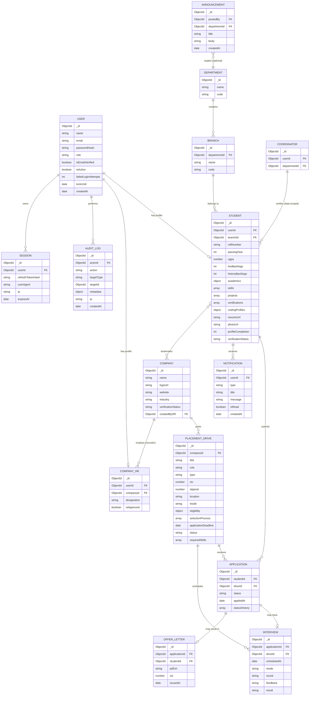

# ER Diagram — AISSMS Placement Portal

```mermaid
erDiagram
    USER ||--o| STUDENT : "has profile"
    USER ||--o| COMPANY_HR : "has profile"
    USER ||--o{ AUDIT_LOG : performs
    USER ||--o{ SESSION : owns

    DEPARTMENT ||--o{ BRANCH : contains
    BRANCH ||--o{ STUDENT : "belongs to"

    STUDENT ||--o{ APPLICATION : submits
    STUDENT ||--o{ NOTIFICATION : receives
    STUDENT }o--o{ COMPANY : bookmarks

    COMPANY ||--o{ PLACEMENT_DRIVE : posts
    COMPANY ||--o{ COMPANY_HR : "employs (recruiter)"

    PLACEMENT_DRIVE ||--o{ APPLICATION : receives
    PLACEMENT_DRIVE ||--o{ INTERVIEW : schedules

    APPLICATION ||--o| INTERVIEW : "may have"
    APPLICATION ||--o| OFFER_LETTER : "may result in"

    COORDINATOR ||--o{ STUDENT : "verifies (dept-scoped)"

    ANNOUNCEMENT }o--|| DEPARTMENT : "targets (optional)"

    USER {
        ObjectId _id
        string name
        string email
        string passwordHash
        string role
        boolean isEmailVerified
        boolean isActive
        int failedLoginAttempts
        date lockUntil
        date createdAt
    }

    STUDENT {
        ObjectId _id
        ObjectId userId FK
        ObjectId branchId FK
        string rollNumber
        int passingYear
        number cgpa
        int liveBacklogs
        int historyBacklogs
        object academics
        array skills
        array projects
        array certifications
        object codingProfiles
        string resumeUrl
        string photoUrl
        int profileCompletion
        string verificationStatus
    }

    COMPANY {
        ObjectId _id
        string name
        string logoUrl
        string website
        string industry
        string verificationStatus
        ObjectId createdByHR FK
    }

    COMPANY_HR {
        ObjectId _id
        ObjectId userId FK
        ObjectId companyId FK
        string designation
        boolean isApproved
    }

    PLACEMENT_DRIVE {
        ObjectId _id
        ObjectId companyId FK
        string title
        string role
        string type
        number ctc
        number stipend
        string location
        string mode
        object eligibility
        array selectionProcess
        date applicationDeadline
        string status
        array requiredSkills
    }

    APPLICATION {
        ObjectId _id
        ObjectId studentId FK
        ObjectId driveId FK
        string status
        date appliedAt
        array statusHistory
    }

    INTERVIEW {
        ObjectId _id
        ObjectId applicationId FK
        ObjectId driveId FK
        date scheduledAt
        string mode
        string round
        string feedback
        string result
    }

    OFFER_LETTER {
        ObjectId _id
        ObjectId applicationId FK
        ObjectId studentId FK
        string pdfUrl
        number ctc
        date issuedAt
    }

    NOTIFICATION {
        ObjectId _id
        ObjectId userId FK
        string type
        string title
        string message
        boolean isRead
        date createdAt
    }

    ANNOUNCEMENT {
        ObjectId _id
        ObjectId postedBy FK
        ObjectId departmentId FK
        string title
        string body
        date createdAt
    }

    DEPARTMENT {
        ObjectId _id
        string name
        string code
    }

    BRANCH {
        ObjectId _id
        ObjectId departmentId FK
        string name
        string code
    }

    COORDINATOR {
        ObjectId _id
        ObjectId userId FK
        ObjectId departmentId FK
    }

    AUDIT_LOG {
        ObjectId _id
        ObjectId actorId FK
        string action
        string targetType
        ObjectId targetId
        object metadata
        string ip
        date createdAt
    }

    SESSION {
        ObjectId _id
        ObjectId userId FK
        string refreshTokenHash
        string userAgent
        string ip
        date expiresAt
    }
```
